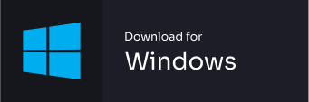

# Download

If you want run Repath Studio as a standalone application, you can download one of the
binaries below.

!!! warning

    This project is in alpha stage!

## Select your operating system

[](https://github.com/repath-project/repath-studio/releases/latest/download/repath-studio-linux.AppImage)

[](https://github.com/repath-project/repath-studio/releases/latest/download/repath-studio-win.exe)

[](https://github.com/repath-project/repath-studio/releases/latest/download/repath-studio-mac.dmg)

[See all](https://github.com/repath-project/repath-studio/releases/latest/)

## Build from source

You also have the option to build the app directly from its source code.

### System Requirements

You need to have the following dependencies installed on your system.

- [node.js](https://nodejs.org/)
- Java SDK (8+) [OpenJDK](https://openjdk.org/) or
  [Oracle](https://www.oracle.com/java/technologies/downloads/)
- [Clojure](https://clojure.org/guides/install_clojure)

### Shell instructions

Clone the project and go into the directory.

```bash { .yaml .copy }
git clone https://github.com/repath-project/repath-studio.git 
```

Go into the directory.

```bash { .yaml .copy }
cd repath-studio
```

Install the dependencies and build the webb application.

```bash { .yaml .copy }
npm install && npm run build
```

Package the electron application.

```bash { .yaml .copy }
npm run dist
```

The app will be available under the `dist` directory.
