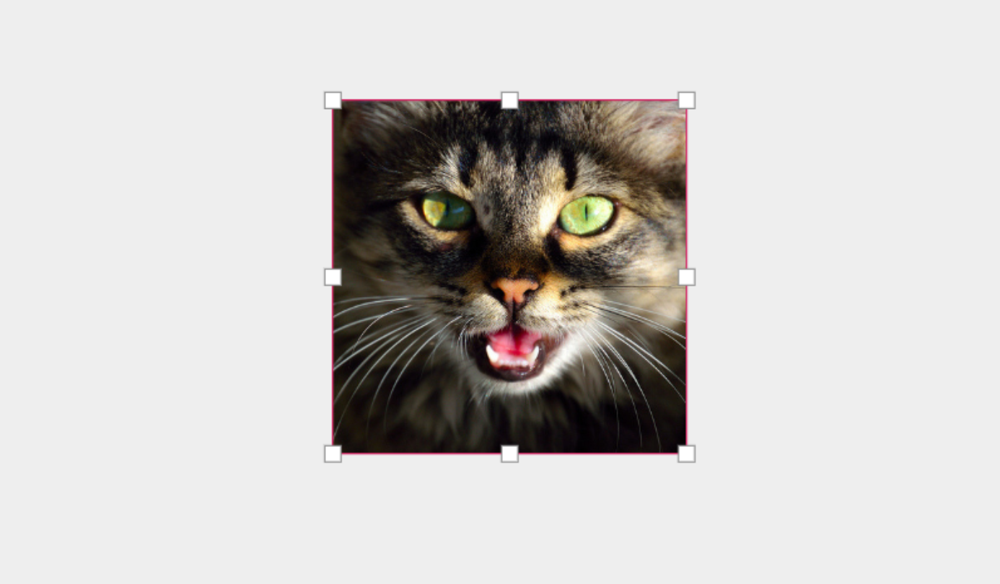
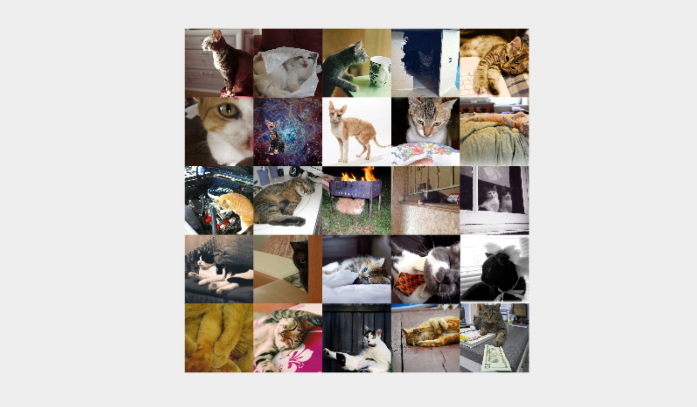

# Interactive Shell (REPL)

Our embedded REPL at the bottom of the editor allows evaluating code to generate shapes, 
or even extend the editor on the fly.

## What is a REPL?

A REPL ([read–eval–print loop](https://en.wikipedia.org/wiki/Read%e2%80%93eval%e2%80%93print_loop)),
also known as command shell, is an interactive computer programming environment that takes
user inputs, executes them, and returns the result to the user.


## Examples

Lets define a `kitty` function that fetches a random cat image from [the cat api](https://thecatapi.com/)
and creates an image element.

```clojure { .yaml .copy }
(defn kitty
  [[x y] width height]
  (-> (js/fetch "https://api.thecatapi.com/v1/images/search" #js {:method "GET"})
      (.then (fn [response]
               (-> (.json response)
                   (.then (fn [body]
                            (let [body (js->clj body :keywordize-keys true)]
                              (image [x y]
                                     width
                                     height
                                     (:url (first body))
                                     {:preserveAspectRatio "xMidYMid slice"})))))))))

```

The output should be `#'user/kitty`. The `kitty` function is now available for use on the
user namespace. Try to generate a cat image by running the following command.

```clojure { .yaml .copy }
(kitty [0 0] 350 350)
```



Wonderful! Now let's try to create a cat collage by creating a 5x5 image grid.

```clojure { .yaml .copy }
(dotimes [x 5]
  (dotimes [y 5]
    (kitty [(* x 100) (* y 100)] 100 100)))

```



Perfection!
