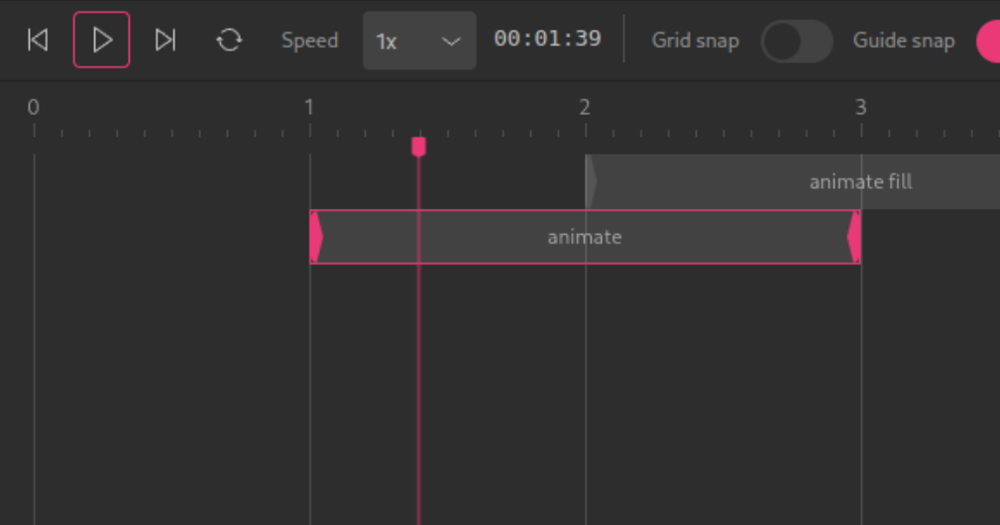

-   :fontawesome-solid-code-branch:{ .lg .middle } __History tree__
   
    ---

    { width="100%" }

    Maintain all user actions and travel through time, without ever losing your undo/redo stack.

-   :fontawesome-solid-terminal:{ .lg .middle } __Interactive SHELL__

    ---

    { width="100%" }

    Evaluate [Clojure](https://clojure.org/) and Javascript code on the embedded REPL to generate shapes, or even extend the editor on the fly.

-   :material-animation-play:{ .lg .middle } __SMIL animations__
   
    ---

    { width="100%" }

    Create and edit [SMIL](https://developer.mozilla.org/en-US/docs/Web/SVG/SVG_animation_with_SMIL) animations, an extension of SVG allowing to animating SVG elements.

-   :simple-svg:{ .lg .middle } __Powered by SVG__

    ---

    Educational-driven exposing the specification and rendering on an [SVG](https://developer.mozilla.org/en-US/docs/Web/SVG) canvas.
    
-   :material-human:{ .lg .middle } __Accessibility testing__

    ---

    Built-in tools that help you evaluate the accessibility of you creations.

-   :material-source-commit:{ .lg .middle } __Open Source__

    --- 

    Distributed under the terms of the [AGPL-3.0](https://github.com/re-path/studio?tab=AGPL-3.0-1-ov-file#readme) license.

